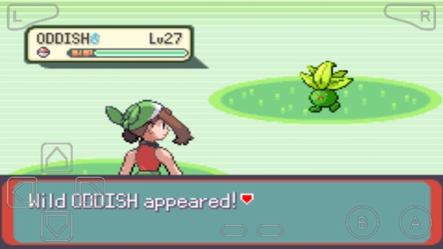
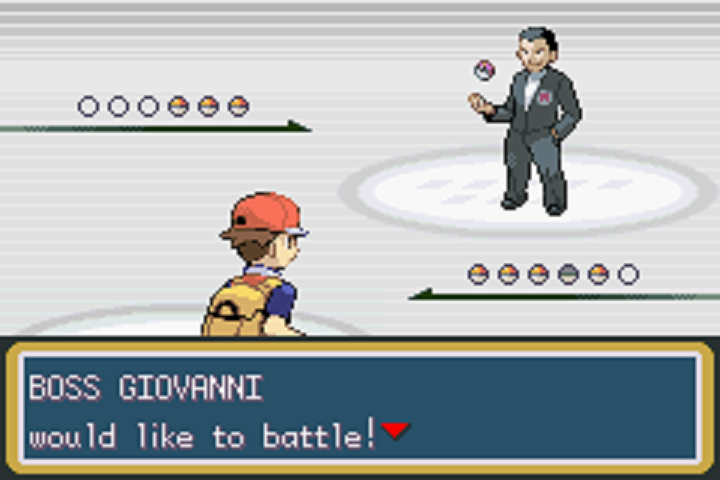
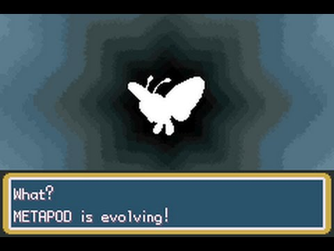
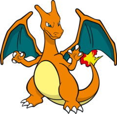
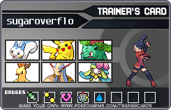
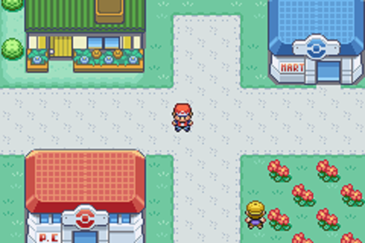
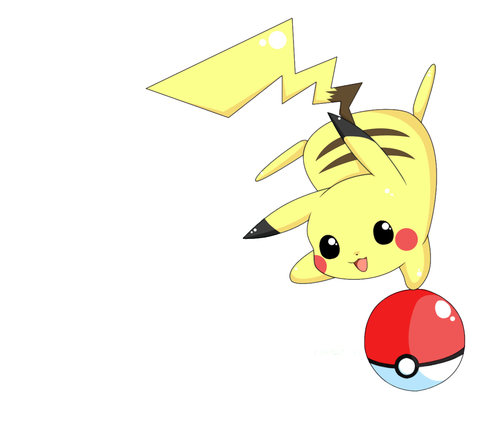

title: My Presentation
class: animation-fade
layout: true

---
class: impact

.contain[]
.responsive[]

---
class: concept

# Hi I'm Fatima

.col-6.space-top[
## @sugaroverflow
### Digital Echidna
### Drupal Diversity & Inclusion
]

.col-6[
.contain.rounded-profile[]
]

---
class: center, story

# The Journey Begins

.contain[]

???
Today we are going to learn Object Oriented Programming from the perspective of Pokemon. We will go on a journey to become the best pokemon trainers and on the way, we will learn concepts of OOP.

- All Pokemon journeys begin with Prof Oak
- Choose our starter pokemon - Pikachu!
- Let's take a look at our Pikachu to learn more about it.

---
# Our first Pokemon!

.col-6.space-top[
## Pikachu
### type: electric
### attack: thunderbolt
]

.col-6[
 .contain[]
]


???
- Here's the data we have about our Pikachu
- The type is electric
- The attack is called Thunderbolt

Lets think of this as our data model. We currently have a *thing* called a Pokemon and it's got these two data points.

(T) How can we model this data in code?
 -> Classes!

---

# Classes are like blueprints
## Properties
### data points

## Methods
### class-specific functions


???
- Properties are things like the name of our Pokemon or the type, something that describes it.
- Methods are functions or actions that our class can do. For Pikachu, for example, it can attack.


(T) Let's go ahead and create our Pokemon class!

---
# Creating a Pokemon Class

```php
class Pokemon {
  public $name;
  public $type;
}
```
???
- `class` keyword
- two properties for the Pokemon class
- (T) we also have one more data point, the pokemon's attack, which is a method.

--
```php
class Pokemon {
  public $name;
  public $type;

  public function attack() {
    /* do something */
    return $attack;
  }
}
```

???
- `function` keyword
- The method body holds the functionality.
- Sometimes functions return things - like in this case, the function is returning an attack function.

(T) Now that we have a pokemon class with some basic properties and an attack function, we need one more thing to be able to create a Pokemon - a Constructor!

---
# Constructing a Pokemon
### PHP provides magic method: `__construct()`

```php
class Pokemon {
  public $name;
  public $type;

  public function attack() {
    /* do stuff */
    return $attack_stuff;
  }

  public function __construct($name, $type) {
      $this->name = $name;
      $this->type = $type;
  }
}
```

???
- So here's our pokemon class again with the addition of a constructor.
- A constructor is a cool thing called a "magic method" that's provided by PHP that allows to create "objects of a class"

--
### an *object* is an *instance* of a *class*

???
-  an object is an element (or instance) of a class
- objects have the behaviors of their class.

(T) So now we have our class and it's constructor, how do we create an actual Pokemon object?
---
# Creating a Pokemon Object

```php
public function __construct($name, $type) { ... }
```
--

### Instantiating a Pokemon object:
```php
$pikachu = new Pokemon('Pikachu', 'Electric');
```
--

### Calling a method from the class:

```php
$pikachu->attack();
```

???
- recall our constructor from our Pokemon class had two variables passed into it which means we need these two variables to create a Pokemon.
- `new` keyword to instantiate
- now that we've created our pikachu, we can call methods that belong to the class.
- but this is all pokemon right? Let's look at a real life example.

(T) Now, lets take a look at an example of a class in Drupal core.
---
# Classes in Drupal (example)

```php
class Link {
  public function __construct($text, Url $url) {
    $this->text = $text;
    $this->url = $url;
  }
}
```

???

- Here's an example of a constructor from the Link class in Drupal core that takes two parameters $text, and a Url object $url. Don't worry about that object for now, lets focus on the constructor.
- (T) Now lets look a place in core where this Link constructor is used to create a link!

--
```php
abstract class Entity implements EntityInterface {
  public function toLink($text = NULL, $rel = 'canonical', array $options = []) {
    // do stuff to variables
    return new Link($text, $url);
  }
}
```
???
- The Entity class' toLink Function returns a Link object that it creates from two variables, a text and a url.

- Yay, we've looked at some basic stuff for classes. Now, we're going back to our story.

(T) Pikachu and you have been travelling for a while now. Tonight, you're in the forest... and suddenly -a wild pokemon appears!

---
class: center, story
# A Wild Pokemon Appears!

.center.contain[]

???
- Battle!
- And you win this battle and capture an Oddish!
- Congrats!
- But what's an oddish and what kind of attack does it have?

(T) Lets analyze our Pokemon to understand them better

---
# Our Pokemon

.col-6[
.small[]
## Pikachu
### type: Electric
### attack: Thunderbolt
]

.col-6[
.small[]
## Oddish
### type: Grass
### attack: Poison Fire
]

???

- Here are the data points of our two pokemon!
- They have different types and different attacks.
- We are going to have to modify our Pokemon class to account for the different types and how they'll change in the future.
- There's an OOP concept that makes this much easier for us - Inheritance!

(T) Lets look at inheritance!
---

# Inheritance is about sharing

## parent class
## child classes
### - inherit methods from the parent class
### - can override methods or properties

???
- Inheritance is a way that classes and objects relate to one another.
- We have a parent class which defines certain properties and methods.
- Child classes inherit from the parent class
- which means they can inherit the methods
- and/or override them if they would like


--
## PHP is a single inheritance language

???

One last thing before we look at an example is that PHP is a single inheritance language which means a class can only inherit from one parent class at a time.
- but you can inherit from a class that inherits from another class, etc (inheritance inception! jk)

(T) Now, let's look at some Pokemon Inheritance!


---
# Pokemon Inheritance

```php
class Pokemon {
  public $name;
  public $type;

  public function attack() {
    /* do stuff */
    return $attack_stuff;
  }

  public function __construct($name, $type) {
      $this->name = $name;
      $this->type = $type;
  }
}
```

???
- Here's our Pokemon class again with it's properties, the attack method and the constructor.
- (T) To create a child class that inherits from this class, here's what we do:

--
```php

class ElectricPokemon extends Pokemon { ... }
```
???
- `extends` keyword
- `ElectricPokemon` extends Pokemon - which means it's a child class of the parent class, Pokemon and can access all the stuff inside it.
- But we can go one step further with this.

(T) and create a Pikachu class! How you ask?


---
# Extending the Pokemon class

```php

class ElectricPokemon extends Pokemon {
  public $type = "Electric";
}
```

???
- So we have our ElectricPokemon class that inherits from the Pokemon parent class.
- (T) and then we make a Pikachu object

--

```php
class Pikachu extends ElectricPokemon {
  public $name = "Pikachu";

  public function attack() {
    return 'Thunderbolt!';
  }
}
```

--
```php

$pikachu = new Pikachu();
$pikachu->attack(); // "Thunderbolt!"
```

???
- Now if you look closely at this inheritance chain, Pikachu extends ElectricPokemon which extends Pokemon - so Pikachu has access to the attack function.
- and we want to change the behavior of the generic attack() function because we know Pikachu's attack is a thunderbolt.
- so we *override* the parent attack method in our child class.

- Now, if we want to create a Pikachu, we don't need to specify a name or a type because it's more specific of a class.
- and when we call the attack function on Pikachu, it returns "Thunderbolt!" from the overridden attack function.

(T) Now lets look at an example of inheritance in Drupal core!
---
# Inheritance in Drupal

```php
interface WidgetInterface extends WidgetBaseInterface {
   public function formElement(...);
}
```

```php
abstract class WidgetBase implements WidgetInterface { }
```
???

- So we have this WidgetInterface that has a formElement method.
- And this WidgetInterface is implemented by WidgetBase (don't worry about implements too much, we'll get to it soon!)
- What I want to you focus on here is that there's a relation between the WidgetBase where it's using the WidgetInterface.

(T) and then finally...

--

```php
class RangeWidget extends WidgetBase {
  public function formElement(FieldItemListInterface...) {

    $element['from'] = [ ... ]
    $element['to'] = [ ... ]
  }
}
```

???
- This RangeWidget Class *extends* the WidgetBase, which is has a connection to the WidgetInterface (remember) which gets RangeWidget the `formElement` function.
- And since a range widget is a specific type of form widget that lets you enter a range, the function is overridden with that functionality.

- (T) Now, there's one more small thing that I'd like to cover with interfaces - visibility.

---
# Visibility


## public
## protected
## private


???
- you may have seen the keyword `public` in our code previously -and now that we understand inheritance, we can talk about visibility.
-  prefixing the declaration with the keywords:
-  public, protected or private.
- Class members declared public can be accessed everywhere.
- Members declared protected can be accessed only within the class itself and by inheriting and parent classes.
- Members declared as private may only be accessed by the class that defines the member.

(T) Now that we understand inheritance and visibility, we can take our pokemons and get back on the road! In the newest town that we're visiting, we get challenged to a gym battle!


--
### child classes inherit all the *public* or *protected* properties of their parent class.
---
class: story, center

# Gym Battle!

.contain[]

???
- We try our best, but we lose this battle.
- It's mostly due to a lack of strategy
- We know that our pokemon have different types and attacks, but we don't have to use those to our advantage.

(T) From this battle, we've learned that pokemons have strengths and weaknesses. Lets update our data models.

---
# Comparing our Pokemon

.col-6[
.smaller[]
## Pikachu
### type: Electric
### attack: Thunderbolt
### strength: Water
### weakness: Ground
]

.col-6[
.smaller[]
## Oddish
### type: Grass
### attack: Poison Fire
### strength: Water
### weakness: Fire
]

???
- So we've mapped the new data we know about our pokemons!
- Different pokemons have different strengths and weakness based on their types.
- If we want to add this to our pokemon class - we need to be able to retrieve this information quickly and easily.

(T) To do this, we need to create getters and setters for our Pokemon class.

---

# Getting data from our Pokemon

```php

class Pokemon {
  // properties
  // attack() method
  // constructor

  protected $weakness;
  protected $strength;

  public function getWeakness() {
    /* do stuff */
    return $this->weakness;
  }

  public function setStrength($strength) {
    /* do stuff */
    $this->strength = $strength;
  }
}
```

???
- Getters and setters look like regular methods
- except that they are visibility public - so we can use them externally to get protected values from the class
-  its best practice to use getters and setters within your own object rather than do stuff directly

(T) Lets look at Getters and Setters with Inheritance

---
# In child classes

```php
class ElectricPokemon extends Pokemon {
  protected $strength = 'grass';
  protected $weakness = 'water';
  // other properties and methods..
}
```

???
- ElectricPokemon is extending pokemon
- and defining it's strengths and weaknesses.

(T) One more step into inheritance would be the Pikachu class.
--
```php
class Pikachu extends ElectricPokemon {
  // properties and attack() method.
}
```

???
- and here, note that we aren't defining those getters and setters.

(T) Go ahead and create a pikachu object.
--
```php

$pikachu = new Pikachu();
$pikachu->getWeakness(); // returns 'water';

```

???
- So we added getWeakness() method to our Pokemon class
- and if we set a weakness and strength in our Electric Pokemon class.
- which our Pikachu class extends - so it has access to.

- When we create a new pikachu object and call getWeakness() it returns the weakness we set in the parent class.

(T) Lets take a look at some getters and setters in Drupal core.
---
# Getters/Setters in Drupal

```php

class RouteMatch implements RouteMatchInterface {
  public function getParameters() {
    return $this->parameters;
  }
}
```


???
- This is an example of something that I use almost on a daily basis. The RouteMatch class is a really useful service!
- This particular function `getParameters()` allows us to get parameters in the URL of a page.

(P-T) To use this service - and don't worry too much about the syntax just yet, we'll go over services a bit later - we call the method on the service.

--

```php
$params = \Drupal::routeMatch()->getParameters();
```

???

(T) Let's take a recap of what we have for our Pokemon stuff.

---

# Pokemon classes

### `Class Pokemon`
### `Class ElectricPokemon extends Pokemon`
### `Class Pikachu extends ElectricPokemon`


???
- So this is what we have so far.
- overview
- (P-T) and here's what we can do with it.

- But hey we don’t want to just create “Pokemon” anymore - Since we have the ability to create specific types.
- How can we create only specific pokemon and lock down the parent Pokemon class so we can't create generic Pokemons?

(T) OOP gives us a way of doing this called Interfaces.

--

```php
$pokemon = new Pokemon('Pikachu', 'Electric');
$pokemon->attack(); //returns a generic attack

$pikachu = new Pikachu();
$pikachu->attack(); // returns 'thunderbolt!'
```

---

# Interfaces are like contracts
## - all methods are public
## - the class must implement the methods

???

- create code that specifies what classes must implement
- but without defining those methods
- same way as a class
- all methods must be public (just a rule)

- generic pokemon can't be created, but specific pokemon types can be.

(T) Lets look at our Pokemon Interface

---

# Creating a Pokemon Interface

```php
interface PokemonInterface {

  public function setPokemonName($name);
  public function setPokemonType($type);

  public function getPokemonName();
  public function getPokemonType();

  public function attack();
  public function getStrength();
  public function getWeakness();

}

```
???
- all methods are public
- they're defined without any method body

(T) And how can we now use this interface?
---
# Implementing a Pokemon Interface

```php
interface PokemonInterface {
  public function getPokemonType();
  /* more methods */
}
```
--

```php
class ElectricPokemon implements PokemonInterface {
  $type = 'Electric';
  /* other properties and methods */

  public function getPokemonType() {
    return $this->type;
  }
}
```

--

```php
class Pikachu extends ElectricPokemon {
  /* other properties and methods */
  public function getPokemonType() {
    return $this->type;
  }
}
```

???
- `implements` keyword
- lets focus on just the `getPokemonType()` method
- so Pikachu inherits from ElectricPokemon which implements the PokemonInterface
- and so has to implement the functions.

So now that we have a PokemonInterface we can't create generic Pokemons anymore. But do we want to create generic ElectricPokemons? Because that's weird too.

Since we want to keep the functionality of having an ElectricPokemon Class, but we don't want to create objects of that class, we can make this class *abstract*

(T) What's an abstract class?

---
# Abstract classes are like skeletons

## provide *some* functionality
## commonly used as base classes
## can never been instantiated

???
Abstract Classes

An abstract class can provide some functionality and leave the rest for derived class

The derived class may or may not override the concrete functions defined in the base class

A child class extended from an abstract class should logically be related


---
# Abstract ElectricPokemon Class

```php
interface PokemonInterface {
  public function getPokemonType();
}
```

???
So here's our PokemonInterface with the `getPokemonType` method.

--

```php
abstract class ElectricPokemon implements PokemonInterface {
  public function getPokemonType() {
    return 'Electric';
  }
}
```

???
And here's our Electric Pokemon class
- `abstract` keyword

--
```php
class Pikachu extends ElectricPokemon { ... }
```
--

```php
$pikachu = new Pikachu();
$pikachu->getPokemonType(); // returns 'Electric'
```

???
- And finally, we have our Pikachu class which extends ElectricPokemon.
- So the cool thing here is that we have an interface for all Pokemon behavior - but we can't instantiate an interface so we can't make generic Pokemon - GOOD.
- And ElectricPokemon being an abstract class can't be instantiated either, but it can hold methods and properties that Pikachu can inherit.

- So what happens if we try and call those methods from a Pikachu object? - We get Electric! From the ElectricPokemon class. Wohoo interitance and interfaces and abstract classes all working together.

(T) Now we'll look at an example from Drupal Core.
---
# Interfaces in Drupal

```php
interface FormInterface {
  public function getFormId();
}
```
???
Drupal core provides a FormInterface. One of the methods inside this interface is `getFormId()`.

--

```php
abstract class FormBase implements FormInterface { }
```

???
- The abstract class Formbase implements the FormInterface - so it has to define all of the method bodies. But since it's an abstract class, it needs to be extended to be used.

--


```php
class UserLoginForm extends FormBase {
  public function getFormId() {
    return 'user_login_form';
  }
}
```

???
- Formbase is generally extended by actual forms, like the User Login Form class here.
- Since the UserLoginForm extends FormBase, which implements FormInterface, it has to define the getFormId() function.


---
class: story, center

# Your Pokemon is evolving!

.contain[]

???
- our Charmeleon is evolving to a Charizard!
- but how can we add this ability to our Pokemon classes?
- Not all Pokemon can evolve so we can't add to the interface.
- some evolve in different ways - stone, battle, etc and this depends on the exact Pokemon - not the type.
- how can we model this ability to evolve without putting it in our base class.

(T) PHP gives us this awesome ability to use snippets of code with Traits!
---
# Our Pokemon is Evolving!

.col-6[
.small[]
## Charmeleon
## type: Fire
## attack:
]

.col-6[
.small[]
## Charizard
## type: fire
## attack:
]

???
- to change it up a little lets look at our Charmeleon
- we won this guy in a random battle encounter by the volano ruins
- our Charmeleon is evolving to a Charizard! (super awesome!)

(T)  How can we model this evolution in our code? Since not all pokemon evolve - and they don't all  evolve in the same way.
---

# Traits are like code snippets
## - code reuse
## - avoid inheritance
## - cannot be instantiated

???
- code copy pasta
- PHP method of code reuse
- for single inheritance libraries
- reduces limitations of single inheritance
- similar to a class
- can't create a trait on it's own

---
# Creating a Pokemon Evolution Trait

```php
trait PokeEvolutionTrait {
  public function evolve() {
    return new $this->nextStage;
  }
}
```

???
- pokeevolutiontrait
- has an evolve function
- which returns a new pokemon
- of the nextStage that it is used on or the nextStage of _this_ which is the pokemon this evolve function will be called on.

(T) So how do we use a trait?
--

```php
class Charmeleon extends FirePokemon {
  use PokeEvolutionTrait;
  public $nextStage = 'Charizard';
}
```
???
- So here's the charmeleon class which extends firepokemon
- we use the `use` keyword to signify we are using the trait.
- here we're defining a property for the next stage.
(T) and we need the Charizard class
--
```php
class Charizard extends FirePokemon { ... }

```

???
- There should also be a class for the next stage of pokemon - lets assume there's stuff in there for now.
(T) now if we create a charmeleon and try to evolve it.
--
```php
$charmeleon = new Charmeleon();
$charmeleon->evolve(); // Returns a Charizard object!

```


???
- it returns a charizard!

(T) Lets look at an example of Traits in Drupal
---

# Traits in Drupal

```php

trait StringTranslationTrait {
  protected function t(...) {
    return new TranslatableMarkup($string, $args,
     $options, $this->getStringTranslation());
  }
}
```

???
- Look at the string translation trait
--

```php
abstract class PluginBase extends ComponentPluginBase {
  use StringTranslationTrait;
}
```
???
- much wow

---
class: story, center

# You won your first badge!


???
- you’ve won your first badge!
- how to model this in our code
- there needs to be a system to earn badges
- badge system is a functionality that can change because different badges will have different requirements to earn them.

(T) Plugins!

---

# plugins are like functional lego blocks

## many types of plugins
## different behaviors | common interface


???
Plugins implement different behaviors via a common interface.
- There are many different existing types of plugins:
- annotated, yaml (menus, routes, and services), hook, discovery, static
- And making a custom plugin takes a lot of work:

To create a custom plugin:
Annotation Plugin Definition
Plugin Manager Service
Plugin Interface
Plugin Base
Example Implementation
Controller (optional)

It's rare.

- There are whole talks about creating custom plugins. Drupalize me does a great post about "Unwraveling the Plugin System in D8" using an ice cream shop as a metaphor for creating the components of a custom plugin.

- So today, we aren't going to be able to create a custom Drupal Badge plugin, but we can look at something a little simpler. We can extend an existing Plugin type in Drupal 8

(T) We're going to shift gears here and do a combination of Drupal & Pokemon code now. We're going to extend an existing plugin - the Block plugin.


---
# Pokemon Profile Block

```php
/**
 * Provides a 'PokemonProfileBlock' block.
 *
 * @Block(
 *  id = "pokemon_profile_block",
 *  admin_label = @Translation("Profile Block for a Pokemon"),
 * )
 */
class PokemonProfileBlock extends BlockBase { ... }
```

## Annotations-based plugins
### annotation data lives in the same file
### allows for complex nested data

???
- a block is what we call an annotation based plugin
- an annotation - this key value structure in the comment you see above the class definition there, starting with the @ Block which implies this is a block plugin type.
- We'll go into more detail about what goes into the class, but first I want to point out what an annotation is.

- The annotation meta-data lives in the same file and is an integral part of the class that implements the plugin
- allows for complex structured data aka nesting
- you can indicate strings for translation
- makes Drupal use less memory when discovering plugins

(T) Lets take a closer look at what goes inside this Pokemon Profile block.

---
# Pokemon Profile Block

```php
/**
 * (annotation here)
 */
class PokemonProfileBlock extends BlockBase {

  public function build() {
    $render = [];

    // build $stuff of pokemon info.

    $render['pokemon_container'] = [
      '#type' => 'container',
      '#markup' => $stuff,
    ];

    return $render;
  }
}
```

???
- removed the annotation to make space for the code but it's still there.
- So we're making this block to display a profile for our pokemons. We extend the BlockBase plugin and in the $build function that blockBase provides we can build a container of some markup and display it on a page.
- And just to recap, we did this because creating custom plugins requires a lot of components and isnt' really a beginner topic, so to use plugins, we'd rather extend an existing plugin type - aka blocks.

(T) Back to story!
---
class: story, center

# Pokemon Leagues

## To be the very best

.contain[]

???
Now that you've won a lot of battles and some fame, you've been invited to compete!

Before you can join the competition, you need to submit your pokemon trainer card with all of your pokemon's stats.

Let's say we've been saving those stats into a database somewhere - and now, we want to retrieve them.

(T) OOP provides us a functionality for "retreiving things" in a pluggable way.

---
class: concept
title: OOP | Services

# services are like swappable operations

## - same function | swappable code
## - globally available
## - usually an interface defining methods

???
Services provide the same functionality, and are interchangeable, differing only in their internal implementation.

package reusable functionality in one place to perform an operation like sending an email or database query.
- the operation always stays the same

 ideally, there should also be an interface that defines the methods that may be called.

"service" (such as accessing the database, sending email, or translating user interface text)

(T) Lets look at our Pokemon Service!
---
# Creating a Pokemon Service

```php
interface PokeDataInterface {
   public function getYearlyStats(PokemonInterface $pokemon, int $year);
}

```
???
- an interface for getting pokemon data
- an example of one of the methods it might have is getyearlystats
- since interface, no code

(T) if this is the interface, what does the service look like?

--

```php
class PokeDataService implements PokeDataInterface {

  public function getYearlyStats(PokemonInterface $pokemon, int $year) {
    // does query stuff
    return $array_of_data;
  }
}
```

???
- creating a pokemon service that retrieves data about our pokemon for us - their wins, losses, strengths, and weaknesses.

we are going to make the assumption that there exists a "PokeDataInterface" which defines an interface for generating data from the pokedatabase for pokemons.

Our service then implements this interface and provides the functionality.

(T) How do we call our service?

---
# Calling our Pokemon Service

```php
$pikachu = new Pikachu();

```
???
- create pikachu object
(P-T) how do we load the service?
--

```php
$pokeDataHelper= \Drupal::service('pokemon.pokedataservice');
```
???
- globally loading the service by it's ID
(P-T) now we want to call a method from the service
--

```php
$data = $pokeDataHelper->getYearlyStats($pikachu, '2018');
```
???
- calling the method from the service and passing the parameters retuns me the data.

(T) Services in Drupal

---

# Services in Drupal

## Drupal core provides a lot of services

### `core.services.yml`


```php
  current_user:
    class: Drupal\Core\Session\AccountProxy
```
???
- Drupal core provides a LOT of services you can use
- one common one is the current_user service
- provided by the AccountProxy class
(P-T) - how do we load the service globally?

--

```php
$current_user = \Drupal::service('current_user');
// access something from the $current_user
```
???
- same way of calling it by ID
- and then you can do stuff.

(T) So I keep saying this "load globally thing" but what's the best way to load our services?


---

# When possible, inject your services

## - pass as arguments to a constructor
## - or use setter methods


???
- preferred method for accessing and using services in Drupal 8 and should be used whenever possible.
- Rather than calling out to the global services container, services are instead passed as arguments to a constructor or injected via setter methods.
- Many of the controller and plugin classes provided by modules in core make use of this pattern and serve as a good resource for seeing it in action.

- dependency injection
- using services.

- Do you remember our Pokemon Profile Block?
(T) Let's inject our dataService into the block to use it to display stats.

---
# Injecting the pokeDataService
```php
/**
 * (annotation here)
 */
class PokemonProfileBlock extends BlockBase implements ContainerFactoryPluginInterface {
  // do stuff
}
```
???
- The first step is that your custom block needs to extend the ContainerFactoryPluginInterface.
- The key to making plugins use dependency injection is to implement the ContainerFactoryPluginInterface.
- When plugins are created, the code first checks if the plugin implements this interface. If it does, it uses the create() and __construct() pattern

(T) Lets start with the constructor

---
# Injecting the pokeDataService

```php
/**
 * (annotation here)
 */
class PokemonProfileBlock extends BlockBase implements ContainerFactoryPluginInterface {
  protected $pokeDataService;

  public function __construct( PokeDataInterface $pokeDataService) {
    $this->pokeDataService = $pokeDataService;
  }
}
```
???
- The constructor, loading the service property.
(T) Lets now add the create() function:

---
# Injecting the pokeDataService

```php
/**
 * (annotation here)
 */
class PokemonProfileBlock extends BlockBase implements ContainerFactoryPluginInterface {
  protected $pokeDataService;

  public function __construct( PokeDataInterface $pokeDataService) {
    $this->pokeDataService = $pokeDataService;
  }

  public static function create(ContainerInterface $container) {
    return new static(
      $container->get('pokemon.pokedataservice'),
    );
  }
}
```
???
- create()
- From the services container, load the pokedataservice
- and do stuff

(T) Andddd that's dependency injection - you've got this!

And so...
---
class: story, center
# The Adventure Continues

.contain[]
#### >> continue
???
- There's a lot out there in OOP and as you do more backend work, you'll discover new and interesting things! and the OOP adventure will continue.

- and that each of everyone of you has the potential to write OOP and backend code - I know you do.

- I hope this session helps to provide a foundation for the basics and form some ideas and mappings from which you can build and learn and grow. I know that each of you has the potential to be awesome object oriented programmers, so hang in there you got this!

I wish I could give everyone a drupal badge!


---
# Thank you!

.col-8.space-top[
  ## slides: bit.ly/slideslink
  ## feedback:
  ### special thank you to @cottser
]

.col-4[
.responsive[]
]

# Questions?

